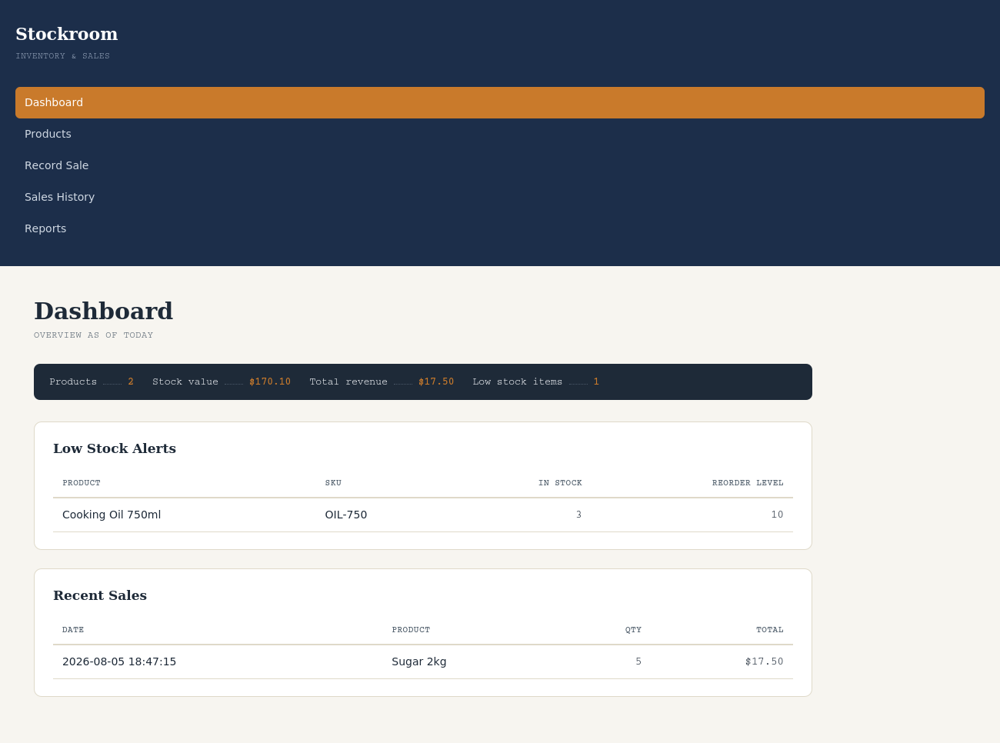
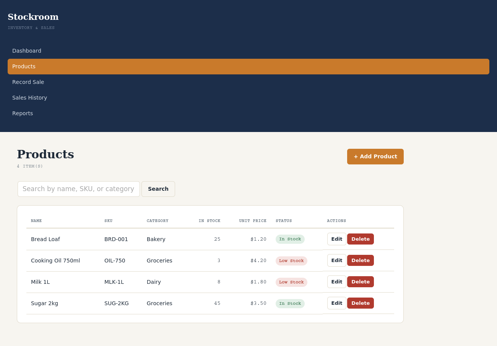
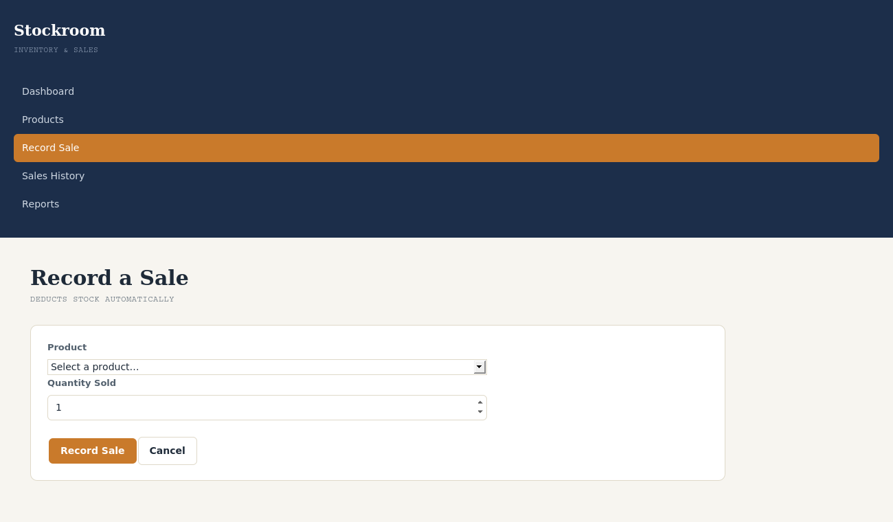

# Stockroom - Small Business Inventory & Sales (POS) System

**Author:** Bervely Pangwana
**Tools used:** Python, Flask, SQLite, HTML/CSS, Jinja2

## Project Overview
A full-stack web application for a small business to manage product
inventory and record sales. Unlike the analytics/database projects in this
portfolio, this is a working, interactive application with a real backend -
built to demonstrate CRUD operations, server-side logic, and functional
web development, not just data analysis.

## Features
- **Dashboard:** live overview of total products, total stock value, total
  revenue, low-stock alerts, and recent sales
- **Product management (full CRUD):** add, view, edit, delete products, with
  server-side validation (duplicate SKU detection, required fields, numeric
  checks) and search/filter
- **Sales recording:** select a product and quantity; the system
  automatically calculates the total, deducts stock, and **prevents
  overselling** (blocks a sale if requested quantity exceeds available stock)
- **Sales history:** full transaction log
- **Reports:** top products by revenue, revenue by category

## Tech Stack & Architecture
- **Backend:** Flask (Python), using raw SQL via `sqlite3` (not an ORM) -
  deliberately chosen to directly demonstrate SQL skills within the
  application layer, consistent with the database project in this portfolio
- **Database:** SQLite (`inventory.db`, auto-created on first run)
- **Frontend:** Server-rendered HTML via Jinja2 templates, custom CSS (no
  frontend framework) - a "stock ledger" visual design: navy and warm rust
  accent colors, monospace type for numbers/SKUs, evoking a physical stock
  ledger/receipt

## Database Schema
- **products**: id, name, sku (unique), category, quantity_in_stock, reorder_level, unit_price, supplier
- **sales**: id, product_id (FK), quantity_sold, unit_price_at_sale, total_amount, sale_date

Recording a sale is a transaction that touches both tables: it inserts a row
into `sales` and decrements `quantity_in_stock` in `products` - with
validation to prevent selling more stock than is available.

## Screenshots

### Dashboard


### Product Management


### Recording a Sale


## How to Run Locally with Docker Compose

1. Install Docker Desktop and make sure it is running.
2. Build and start the app:

  ```bash
  docker compose up --build
  ```

3. Open your browser to <http://localhost:5000>.
4. The SQLite database is created automatically on first run and stored in the
  `inventory-data` Docker volume.

If port `5000` is already in use, choose another host port:

```bash
APP_PORT=5050 docker compose up --build
```

In PowerShell, use:

```powershell
$env:APP_PORT="5050"; docker compose up --build
```

Then open <http://localhost:5050>.

To stop the app, press `Ctrl+C` in the terminal, then run:

```bash
docker compose down
```

To remove the local database and start with a fresh empty inventory, run:

```bash
docker compose down -v
```

### Initial Login Credentials

This app does not currently include user authentication, so there is no initial
username or password. Open <http://localhost:5000> and start using the dashboard
directly.

## How to Run Locally without Docker

1. Install dependencies: `pip install -r requirements.txt`
2. Run the app: `python app.py`
3. Open your browser to <http://127.0.0.1:5000>
4. The SQLite database (`inventory.db`) is created automatically on first run

## Testing
Core functionality (adding products, duplicate SKU rejection, recording
sales, stock deduction, and blocking oversell attempts) was verified with a
set of automated tests using Flask's test client before this was considered
complete.

## Limitations & Future Improvements
- No user authentication -in a real deployment, login/roles (e.g. cashier
  vs. manager) would be needed
- No pagination on product/sales lists - fine for a small catalog, would
  need addressing at larger scale
- Reports are basic; could be extended with date-range filtering and charts
- Currently single-currency, single-location a real multi-branch business
  would need location tracking per product
